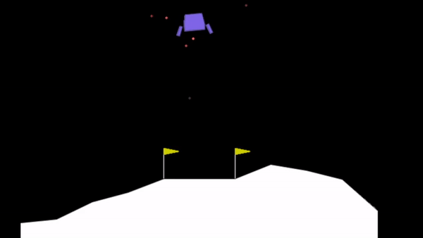

# Q-Learning for the Lunar Lander Game
## Lunar Lander
The example in this repository uses Q-learning to control a lunar lander robot to guide it to an optimal landing on the surface. It uses the publically available [Gymnasium environment](https://gymnasium.farama.org/) from OpenAI to play the game and receive rewards for learning. 

  

## Q-Learning
In Q-Learning, the so-called Q function maps states and actions to a potential reward that would be obtained if the action would be executed in the given state, namely $$Q:S\times A\mapsto R$$

If $Q$ were known perfectly, it would be straight forward to choose an optimal strategy to collect the most reward possible from any initial state. Q-Learning refers to the process of learning the Q-function from exploration, exploitation and observations within the (simulated) environment. After taking an action $a_t$ in state $s_t$, the environment advances to a new state $s_{t+1}$ and a concrete reward $r_t$ is received. The Q function is updated using the Bellman equation
$$Q^{new}(s_t,a_t)=(1-\alpha)Q(s_t,a_t)+\alpha(r_t + \gamma \max_a Q(s_{t+1},a))$$
Here, $\alpha$ denotes the learning rate and $\gamma$ denotes a discount factor that allows to control the balance between short-term and long-term rewards. $\max_a(s_{t+1},a)$ is the (esimated) maximum reward possible to achieve from the future state $s_t$.

Compare [here](https://en.wikipedia.org/wiki/Q-learning) for more details.
## Deep Q-Learning
As neural networks are universal function approximators, it is straight forward to use a neural network to learn Q. 

A very simple DQN network is used that maps the 8 observation states (x & y coordinates of the lander, linear velocities in x & y, its angle, its angular velocity and two booleans representing whether each leg is in contact with the ground or not) to the four discrete states the bot could take, namely 

 * 0: do nothing
 * 1: fire left orientation engine
 * 2: fire main engine
 * 3: fire right orientation engine

Compare the official documentation [here](https://gymnasium.farama.org/environments/box2d/lunar_lander/).

## The network architecture
The network itself is a simple three-layer fully conencted feed-forward network with ReLU activiations in between.

    class DQN(nn.Module):
    def __init__(self):
        super(DQN, self).__init__()
        self.layer1 = nn.Linear(8, 128) 
        self.layer2 = nn.Linear(128, 128)
        self.layer3 = nn.Linear(128, 4) 

    def forward(self, x):
        x = F.relu(self.layer1(x))
        x = F.relu(self.layer2(x))
        return self.layer3(x)

## Exploration vs. Exploitation
Especially in the beginning of the learning process, the approximation for Q is very bad. Using the (so-far) learned Q to guide the simulation can thus yield unstable behavior. It also discourages exploration as for some actions a (potentially small) reward is known (as the bot has taken that action in the past) where for some other actions a (potentially big) reward is unknown. The model could prefer to take the *safe bet* and never explore the unknown states. To prevent this, a epsilon-greedy strategy is deployed to faciliate exploration in the beginning of the learning scheme. 

Given the current state and the number of learning steps already taken, one out of two possible actions are choosen at each time: With a certain probability $\epsilon$, a competely random action is taked and $Q$ is ignored whereas with probability $1-\epsilon$ the (estimated) optimal action based on the Q function is taken. $\epsilon$ starts high (90% probabilty) and exponentially decays over time to a small value (5%) once Q is reliably learned. 

    EPS_START = 0.9
    EPS_END = 0.05
    EPS_DECAY = 1000

    steps_done = 0

    def select_action(state):
        global steps_done
        sample = random.random()
        eps_threshold = EPS_END + (EPS_START - EPS_END) * \
            math.exp(-1. * steps_done / EPS_DECAY)
        steps_done += 1
        if sample > eps_threshold:
            with torch.no_grad():
                return policy_net(state).max(1)[1].view(1, 1)            
        else:
            return torch.tensor([[env.action_space.sample()]], 
              device=device, dtype=torch.long)

## Double Q-Learning
It is known that traditional Q-Learning tends to overestimates the value of actions due to the maximization strategy in the Bellman equation updates. It has been [shown](https://arxiv.org/pdf/1509.06461.pdf) that this can lead to decreased performance of the trained agent and thus a dual-learning scheme is proposed to compensate. In double Q-Learning, two Q-functions are learned. One (the policy) is used to pick the (estimated) best action for the agent and being updated with the observed reward as according to the Bellman equation. During evaluation of the potentially best reward achievable in future states, the other Q-function (target) is used. 

        state_action_values = policy_net(state_batch).gather(1, action_batch)
        next_state_values = torch.zeros(BATCH_SIZE, device=device)
        with torch.no_grad():
            next_state_values[non_final_mask] = 
              target_net(non_final_next_states).max(1)[0]
        expected_state_action_values = (next_state_values * GAMMA) + reward_batch

This target function is updated gradually (much more slowly) by mixing its weights with the policy Q-function.         

    target_net_state_dict = target_net.state_dict()
            policy_net_state_dict = policy_net.state_dict()
            for key in policy_net_state_dict:
                target_net_state_dict[key] = 
                  policy_net_state_dict[key]*TAU + target_net_state_dict[key]*(1-TAU)
            target_net.load_state_dict(target_net_state_dict)

There, $\tau$ is 

    TAU = 0.005

so updates to the target network are done very slowly and gradually. 

## Further read
Compare the [Reinforcement Learning (DQN) Tutorial](https://pytorch.org/tutorials/intermediate/reinforcement_q_learning.html) for additional information. Most code in this repository is taken from there and adapted to the Lunar Lander environment. 